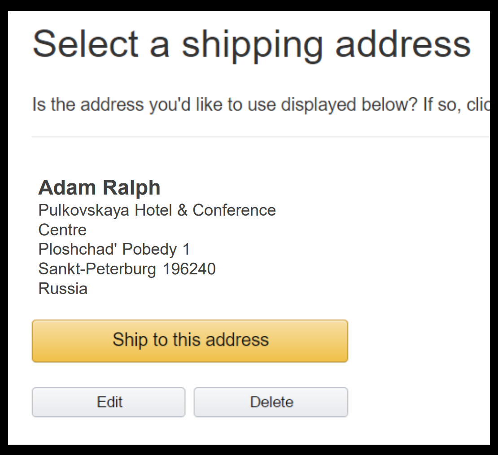
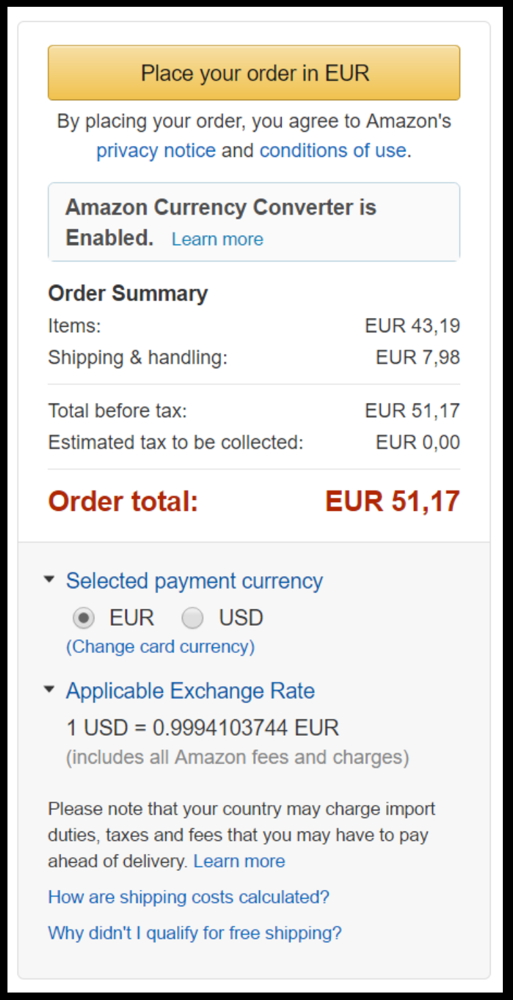
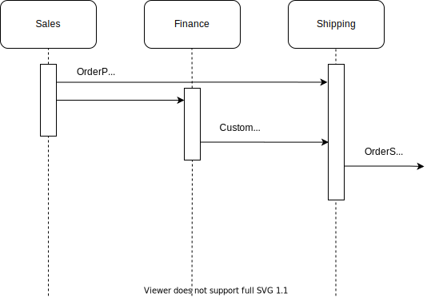
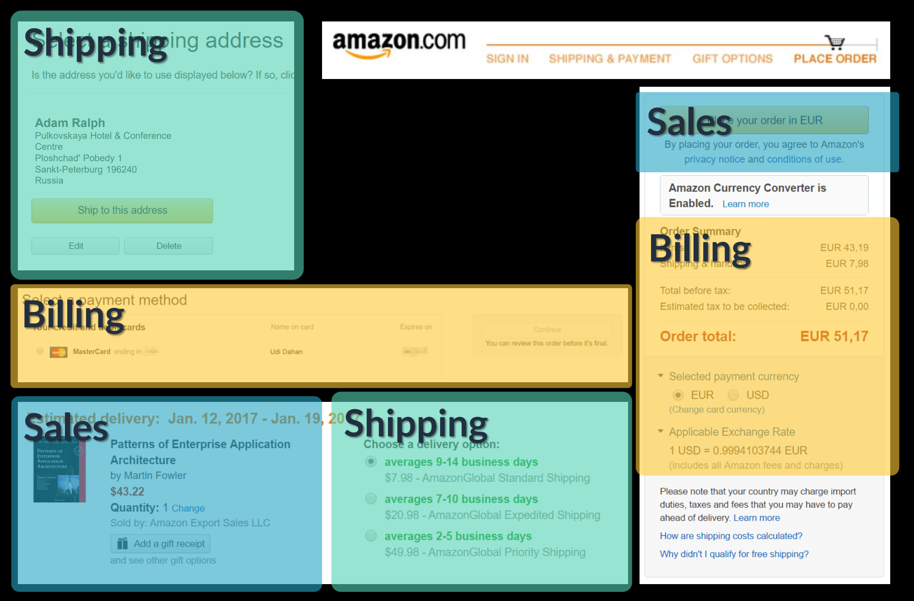
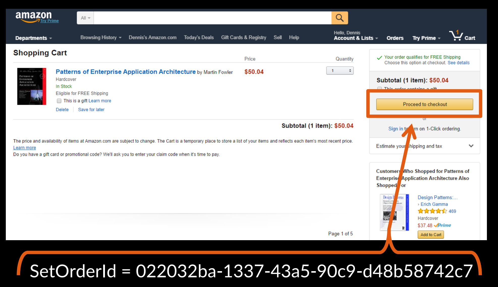
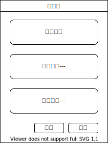

下面这个例子来自于 Finding your service boundaries - a practical guide - Adam Ralph (https://www.youtube.com/watch?v=tVnIUZbsxWI&t=2482s)。
以下为中文译本

我相信大家都在亚马逊之类的网站上买过东西。当你在亚马逊上买东西的时候就开始了一个工作流。第一步，下单


然后选择你的送货地址



选择使用的信用卡


再选择送货方式


再确认



直到你最终完成整个下单过程。
我们都知道亚马逊不是一个 Monolith。
它也许是世界上最 Service-oriented 的公司了。
亚马逊发布的时候不会打包成一个T的应用，然后一起发布。
所以你可以假设在这个工作流中是有很多个Service参与的，它们被某种形式编排，从而使得流程变成这个样子。
那么在你下单的时候，我们看一下后端的会有哪些 Event。
它们可能是这个样子的：



有 sales，finance，shipping 三个 service。
当我们点击确认按钮的时候，command 被发往 sales，它可以做它想做的任何逻辑。比如检查所购商品是不是还有货，如果还在售但是库存不足了，我们可以往供应商再追加一笔采购单等。最终，sales 说，我搞定了，到下一步吧。

订单被创建出来，然后发布一个 event 给 finance 和 shipping。
finance 收到这个 event 的时候，它可以为这个订单收取客户的费用。
它接着可能会发一个 order billed 的事件。
然后 shipping 知道订单创建了并且被 billed 了，它就可以发货了。
发货完成之后，再发一个 shipped 事件出来。

问题是：这些 event 都包含什么字段呢? 是不是 order placed 事件需要包含 shipping 所需的所有字段呢? 要不然 shipping 咋知道发往哪里。
是不是事件需要包含 finance 像客户收费所需的所有信息呢? 比如客户的信用卡详情之类的东西。

这么搞是可以行得通的。但是这种方式带来的问题是“耦合”。
如果事件需要包含送货方式，信用卡详情等所有信息，
我们又回到了高度耦合的被动场面里了。
我们又不能以独立的方式来修改系统行为了。

假设我们要开始支持用比特币付费了，我们需要给 sales 增加关于如何用比特币收费的信息。所以 sales 可以把这些信息再传给 finance。

如果我们要开始售卖电子书了，我们不希望买电子书也提供一个送货的门牌号。
所以我们又要修改 sales，从而它可以把电子书的信息传给 shipping。

上面这样的 event 就是所谓的 fat event。
可以看到，如果我们要开始卖电子书，或者收取比特币，这些 event 会变得越来越 fat，字段越来越多。
再某些时候，一些字段允许为 null，在其他场景下，这些字段又是必填的。
当它们是 null 的时候，事情就变麻烦了。
那我们如何把 fat event 重新又变回 thin event 呢? 如何让系统变得更松耦合呢?

如果我们在这些 event 上只包含 id 会怎么样?
如果 sales 在 order placed 的事件里仅仅说 order123 下单了。
finance 收到 order123 之后，它已经知道如何对这个订单收费了。
它要么是用信用卡收费，要么是开始一个比特币的交易。
接下来 finance 告诉 shipping，order123 已经被 billed 了。
shipping 收到 order123 之后，它知道要把这个订单配送到一个物理的门牌地址，

finance 和 shipping 是怎么知道如何处理 order123 的呢?



如上图所示，
这种 thin event 可以行得通的前提就在于每个 service 都有自己的 ui，它们可以直接从用户那里得到自己关心的数据。但是这种方法有两个问题

第一个问题是：如果订单要 sales 处理完之后才创建，那么 finance 和 shipping 的界面把自己的数据存到哪里呢? finance 和 shipping 怎么能在订单创建之前就知道订单在哪里呢? 这不就是先有鸡，还是先有蛋的问题了吗?

解决办法就是我们要在这个工作流的开始就把 order id 给生成出来，也就是这里



甚至我们可以直接在网页上用 uuid 生成这个 order id。这使得在工作流的后面的步骤里，shipping 你要发到这个地址，订单id 是 123.
在finance那一步，你要从这个选择信用卡收费，订单id 是123。
直到工作流的最后异步，你才把 command 发给 sales，确认订单。

这样如果你想要支持比特币付款，我们仅仅只需要修改 finance。
因为 finance 收到 order123 的时候，它已经知道了该怎么收费了。
类似的，如果我要支持电子书的线上发货，我们也不需要修改 sales 了，我们可以把改动局限在 shipping 内部。
这么搞唯一诡异的地方就是要在流程的开端就把 order id 生成出来。

第二个问题：如果你把这么几步都填完了，再最后快下单的时候，你老婆从房里出来让你别剁手了，你不得不取消订单。你关闭了浏览器。这个时候，你填的收货地址，你选择的信用卡信息都卡在 finance 和 shipping 的手里，没法往下走了。
这些未完成的订单不算是浪费存储资源，不算是垃圾么?
垃圾只是放错了位置的资源。商家也许非常希望知道是哪些商品被选择了，但是没有完成下单的。
他们可以拿这些数据去优化购物下单的转化流程。这些数据都是非常有分析价值的。
而且你也知道，这些数据不过是数据库里的一行而已，也没有多少人会关心这些数据会带来多少开销。
而且也未必是要落盘到数据库，比如信用卡详情之类的东西，因为其敏感性，也许放在 session 里是更恰当的。这样当订单被取消的时候，这些 session 里的信息也自然就没有了。

在这个例子里，我们可以看到。模块与模块之间有两个集成方式

* 在同一个界面里，左边渲染 sales，右边渲染 billing。两个模块通过共享同一块屏幕的方式实现了基于 UI 的集成
* sales => finance => shipping 的事件里只包含了 id

在这个 UI 集成的例子里，我们可以再展开一下。如果，产品的需求是这样的：



这种情况下，配送方式和收费方式就不再是独立有两个保存按钮了。它们要在点确认按钮的时候统一保存，而且要在同一个弹框里反馈保存成功与否。在这种情况下配送方式和收费方式就不能仅仅提供

```
render()
```

这么一个集成接口。还需要提供

```
render()
save(): err
renderError(err)
```

注入这样的更多的接口出来，才能在 UI 上拼装出所需要的产品体验。但即便是这样，像支持比特币付款这样的需求改动，我们仍然是可以封闭在 finance 模块内部来完成。
