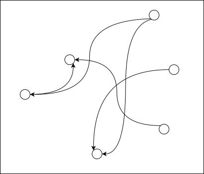

# @rotcare/codegen

把 TypeScript 项目分解为多个 Git 仓库来编写，并提供 TypeScript => JavaScript 的全套构建工具链。

## 拆分的意义

为了控制依赖，避免产生所有人依赖所有人的糟糕结果。

我们有必要把代码拆分成多个 Git 仓库，并通过限制 Git 仓库之间的依赖关系，来促使代码往高内聚低耦合的方向发展。

比如上图中，插件 Git 仓库与插件 Git 仓库之间不能有依赖关系。这样我们就迫使所有的集成代码必须下沉到主板 Git 仓库里去表达。

然而我们在把业务逻辑拆分成多个 Git 仓库来编写的时候，就遇到了代码如何整合回来的问题。

* 主板和插件怎么整合到一起？
* 顶层的那个项目只起到聚合代码的作用，那是不是可以代码生成出来？

`@rotcare/codegen` 所演示的能力，就是利用编译期的工具，在 TypeScript => JavaScript 的过程中，把拆分的代码文件整合回一个文件。这种整合代码的方式，是在所有插件化技术里，实现代价最低的方案。