# 应用

在编辑时，应用是一个”目录“。下分 Ui/Private/Public 三个子目录。

* 例如 Sell 目录，我们就会从 Sell/Ui 下的代码构建出这个应用的前端部分。注意 Sell/Ui 的代码未必是一个可以独立运行的客户端，它只是一份代码。
* 从 Sell/Public 以及 Sell/Private 下的代码，构建出后端的 RPC 服务，这是一个独立被部署的进程，或者独立被部署的 FaaS Functions。
* 后端的 RPC 服务负责对应数据库的初始化建表，以及旧版本数据库的迁移升级。

版本升级的时候，一个应用做完整的整体升级，包括前端，后端，以及数据库。也就是应用是一个最小的发布升级的粒度单元。我们无需考虑前后端服务之间的新旧版本接口兼容性问题，在开发的时候，如果是同目录下的RPC访问关系，可以随意调整接口，而无需担心升级时版本无法兼容。

# 合成项目

简单的应用，可以只用一个 npm 包，一个 git 仓库，也就是 solo project。复杂的应用，需要拆分成多个 npm 包，多个 git 仓库，也就是 composite project。

合成项目有如下规定

* 合成项目包：不能写业务代码，仅仅是声明需要参与合成的插件有哪些，主板是哪个包。也就是一堆 npm 包的依赖列表。
* 插件包之间不能有依赖关系，插件包仅能依赖主板包
* 主板包不能反向依赖插件包

编译构建的时候会把同相对路径的文件“合成”为一个文件。合成文件中与文件名同名的 Class 会被合成，同名的 Method 会由插件的代码覆盖主板的代码。

# 多应用插件

一个插件可以同时给多个