# 部署

目标是实现更小粒度的部署。通过控制一次变更产生的影响范围，实现有信心地快速验证。否则就会导致上线战战兢兢，无法做大的修改，也无法快速获得真实的反馈。阻碍这个目标的原因包括：

* 数据库只能有一个版本，无法多个版本的表结构并存。我们可以用只加字段的方式获得前向的兼容，但是仍然只有一个版本。
* iOS 的 App，微信小程序的 Appid，都需要审核才能发布。使得我们更倾向于多个组织，或者多个客户，共享同一个 App，从而使得他们必须同时使用一个版本。
* 前端调用后端，后端服务之间的RPC调用，都有兼容性问题。当RPC接口发生了不兼容的修改，就需要按顺序同时变更多个服务。
* 数据统计是一级级的聚合表。上游的数据结构变更就会影响到下游的统计逻辑。
* 定时任务需要在延迟队列里提前插入任务。当数据库发生变更之后，回调的接口和参数可能都发生了变化，导致延迟队列回调失败。

我先从一个简单的模型入手，然后逐渐把更真实的现实需求往上加。

## 传统 Web 应用

即便是所谓的传统Web应用，也不太可能是只有一个进程。毕竟前端浏览器，和机房里的RPC服务，那就肯定是两个进程了。

这张图整体分为“输入，主体，输出”三部分。输入的流量有三种：

* 来自人类用户的 UI 操作，比如通过某个 xxx.com 域名进来的浏览器访问
* 来自其他服务的 API 请求
* 该应用主动订阅的其他服务发布的消息队列

极端简单的情况下，我们可以认为 xxx.com 是一个Web应用所有的流量入口。

Web 应用内部也有很多独立部署的零件，但是彼此之间又有版本耦合关系。当使用了不兼容的版本的时候，就发生了错误。处理版本兼容性，有三种选择：

* 我们认为上下游是一个完整的整体：上下游同时变更，不在内部设置防腐层，或者Adapter层
* 上游兼容下游：所有上游的更新要向前兼容之前的 API
* 下游兼容上游：下游设置防腐层，或者Adapter层来翻译不同的版本

对于例子中的 main-ui => main-svc ，我们可以认为两者是在一个完整的整体之内，中间不需要做 Adapter 层。而这个 Web 应用去访问其他的应用，例如给客服应用发消息，那么就可能需要上游兼容下游，或者由下游来兼容上游。不太可能要求一个企业内的所有的应用全部停机，同时维护更新，这样的版本发布策略是不可行的。向前兼容或者 Adapter 虽然可以让发布更灵活，减少停机，但是并不是没有成本的。如果可能尽可能用下图所示的方式来发布

我们发布新版的 v2.main-ui, v2.main-svc，然后切换 xxx.com 域名，从旧的 v1.main-ui 指向新的 v2.main-ui，从而实现了同时发布，不需要考虑 v1.main-ui 访问到了 v2.main-svc 怎么办的问题。这种做法的核心就是从流量入口开始整体切换，内部的组件之间进行版本的强耦合。这种流量入口包括人类用户的 UI，也包括 API 请求的服务注册表，以及消息队列的订阅。

这种简化的 Web ”单体“应用的视角，有如下的挑战：

* 无状态的服务怎么都好弄，关键是数据库怎么办
* 一个独立的网站界面，对应一个独立的数据库，这样的映射关系太简单了。一个数据库可能要支持不同的端，一个端也可能要访问很多个不同服务的数据库

## 缩小发布的影响范围

数据库只能有一个版本的问题，其解决办法就是用多个数据库。这个做法有很多名字

* 在 SaaS 领域，称之为多租户，Multi Tenancy
* 在游戏领域，称之为游戏的区服
* 在腾讯的技术体系里，称之为 SET 化
* 在阿里的技术体系里，称之为单元化

其核心就是要把数据硬切割成多个数据库。其诉求出发点可能是不同的

* 把一个数据库部署在北京，另外一个数据库部署在广州，之间可以有很高的网络延迟。让数据离用户更近
* 支持全链路压测，避免压测产生的脏数据影响生产环境
* 控制变更的影响范围，一次表结构变更只影响其中一个数据库
* 避免不同的租户之间产生数据权限的意外泄露

其实现最简单的可以是把原来在一个 Mysql 表中用字段 tenantId 区分出来的数据，改成每个 tenant 建立一个独立的 Mysql Database。连接到数据库的时候用 USE database_name 指定要连接的数据库。

多租户应该是内置的初始设计，因为事后添加往往代价会更高。

加入了多租户的设计，那么升级的过程就是这样的

最开始，tenant1 和 tenant2 是共享了 v1.main-ui 和 v1.main-svc 的，只是传入的 tenantId 不同，访问的 mysql 数据库不同。

然后 tenant2 把自己的域名指向新部署的 v2.main-ui，从而访问了新部署的 v2.main-svc，实现了对 tenant2 的升级。

如果租户2希望在发布过程中对自己的数据库进行破坏性的升级，也可以在升级开始之前把 tenant2.xxx.com 指向停服维护的公告。等数据库升级完毕了之后再把 tenant2.xxx.com 指向 v2.main-ui。

如果不挂停服公告，那就得保证数据库的升级是向前兼容的，字段只能加不能删。只有旧字段完全没有流量访问了，才能下掉。

即便数据库完全没有变更，我们也是希望分租户的方式来升级后端服务。假设我们有 svc-1, svc-2, svc-3 三个服务，svc-2 只能通过 svc-1 访问到。那么当 v2.svc-1 只开了 1% 流量，而 v2.svc-2 也只开了 1% 流量。那么很有可能访问 v2.svc-1 的流量，并没有命中 v2.svc-2 的那 1%。比较理想的低风险发布是让 1% 的流量，都打给正在发布的 v2.svc-1 和 v2.svc-2。通过分租户，我们可以更早的把所有的服务做一个完整的集成，验证 ok 了，再接着发布其余的租户。

## 客户端1：多租户共享同一个客户端咋办？

域名提供的 H5 是比较简单的。现实去求中，我们有 iOS / Android / 微信小程序，这些带审核的客户端渠道有时无法给每个 tenant 申请一个独立的 app，比如：

* 申请独立 app 需要资质审核，需要费用。不是每个 tenant 都有资质，或者都希望出这个费用
* 独立的 app 流量需要独立获取。大家希望抱团取暖，都用同一个 app，然后 app 内再切割出自己的流量

这个时候就会出现共享版的 app，多个租户共享了同一个 iOS / Android / 微信小程序意义下的版本。这就导致了一份前端代码，可能要访问很多个版本的后端服务。当后端服务版本不一致的时候，前端代码就会出错。这意味着不仅仅数据库不能改表结构，连后端服务的 RPC 结构都不能做不兼容的修改。这样的向前兼容显然是很大的负担，会造成很糟糕的开发者体验。

解决办法就是多版本要打包到一起，做为一个版本进行送审和发版（所谓 Deployment）。然后在运行时，根据实际访问的租户不同，切换这个租户的客户端代码的实际运行版本（所谓 Release）。这种运行流量切换的做法，传统上称之为 feature toggle，a/b test。实际上已经从原本的实验功能，演化为一种版本发布策略了。一个功能做好了先不开流量，等实际成熟，才通过配置下发的方式开流量是一种规避审核速度限制，控制风险的办法。

这样即便多个租户使用同一个 iOS / Android / 微信小程序 App，我们仍然可以运行该租户指定版本的 main-ui，就像用域名发布 H5 页面一样灵活。H5 页面相当于同时完成了 Deployment 和 Release，是最灵活的发布方式。用户只要在浏览器上 F5 刷新，就完成了重新 Deployment。

## 客户端2：不升级咋办？

客户端总是比域名发布 H5 更麻烦的，即便不考虑多租户。就是单纯客户端

* 同时有 iOS / Android / 微信小程序 / 字节小程序 ... 等不同的渠道，不同渠道不会同时更新
* Android 应用经常不升级，很多用户可能停留在一个很早期的版本

所以客户端是很可能一直运行着非常旧版本的代码的。前面说了，v2.main-ui 会访问自己兼容的 v2.main-svc 的后端服务，这样也就会导致旧版本的后端服务一直有访问流量。这显然会有问题

* 数据库如果需要大改表结构，我们可能就是希望停服维护，而不是向前兼容的 Zero Downtime Release 方式。
* 升级之后的数据库表结构不兼容了，旧版本必须强制升级

这里就需要引入一个版本协商的过程。客户端必须经过登陆才能访问服务端，登陆的时候，客户端告诉服务端自己是什么版本，服务端要告诉客户端目前是否维护中，以及应该使用哪个版本来访问。如果客户端过旧了，则要弹框提示用户升级。如果客户端打包了多个版本的代码（Deployment 和 Release 分离的情况），服务端返回的版本号恰好客户端能够提供的，客户端就切换到对应版本的代码执行。

这个版本协商基于数据库中存放的数据来决定。一般都会有一张 migration 表来记录当前数据库是什么版本的，利用类似的机制，我们就可以用 service_version 表来记录不同版本的客户端，应该给予什么样的应答。数据库升级的时候，要同步维护 service_version 表中的数据。如果表结构是兼容的，可能有多个版本的前后端都可以并存。当数据库 Migrate 升级完了，对应的客户端也会被迫升上来，确保版本之间的兼容性。

如果需要立即停服，还需要能够把已有的客户端踢下线的功能。如果每个业务 RPC 请求都会访问 redis 校验 access_token（虽然这有点浪费，但是实践中还是 ok 的），可以把指定租户的 redis 清空，达到迫使客户端重新登陆，重新版本协商的目的。

## 客户端3：UI 跨应用集成怎么办?

未必一个应用的端只有一个，而一个客户端，未必严格只对应一个后端应用。比如我们给客服做一个工单系统，对于客服来说这是一个他们使用的客户端。但是这个端上面要集成非常多的业务线。假设你们公司是酒旅业务，给客服提供的界面上既要酒店业务，也要机票业务。但是显然，酒店业务是有一个独立的后端应用的，机票也是如此。最简单的做法，显然是让客服系统去和酒店，机票这些做服务端的集成。但是这样会引入很强的耦合，任何酒店订单，机票订单的改动，客服这边都要理解其新业务，并做对应的升级。

另外一个办法，也就是所谓的“微前端“架构。让酒店业务机票业务，都能在客服用的系统界面上有一个前台露出。这样客服系统只要在工单的UI区域上给酒店机票这些业务系统做槽位的预留就可以了。但是这样就会出现一个客户端，需要访问不同的业务后端，这些后端都有升级的可能。再加上酒店业务，机票业务都可能都是多租户切分了的，不同租户运行的版本也可能是不同的。这对于”客服的端“是什么版本来说，就非常模糊了。

解决办法就是让客服的端不是一个整体版本号的概念。客服的端是由多个组件拼装出来的，每个组件都有自己的版本。比如我们有如下的目录/文件结构：

* Hotel
  * HotelBackend
    * xxx.ts
  * HotelFrontend
    * HotelOrderDetails.ts
* Flight
  * FlightBackend
    * xxx.ts
  * FlightFrontend
    * FlightOrderDetails.ts
* CustomerService
  * CustomerServiceFrontend
    * WorksheetViewer.ts

HotelFrontend强耦合对应版本的HotelBackend，FlightFrontend强耦合对应版本的FlightBackend。
客服的 WorksheetViewer 组件集成了 HotelOrderDetails 和 FlightOrderDetails 这两个组件。但是这两个组件实际运行时的版本，由组件加载时动态确定，而不是在发布构建客服客户端的时候静态确定。我们可以有两种策略

* 完全动态下发：打包构建的时候只有占位，实际的代码在运行时从远端获取，动态加载。但是只能用于 H5 等内网环境，对于 iOS，微信小程序等环境不允许动态下发代码。
* 打包多版本：打包构建的时候把多个版本的 HotelOrderDetails/FlightOrderDetails 打包进来，运行时可以切已知的版本，但是无法动态加载新增的代码版本。

最原始的 iframe 集成方式的客户端，就是完全动态下发的模式。

## 租户数据库的创建和版本升级

多租户量变引起质变的一个问题是租户数量的变多，使得数据库表结构的创建无法是运维手工做的。必须使用某种自动化程序来 provision （创建）新租户。

* 租户的 database 谁来创建
* 新租户的表都怎么建
* 已有租户的表和数据怎么migrate？

假设我们有 main-svc，也有 host-svc 等其他服务。不同服务的租户创建时机，租户数量都不同。一般，总是有一些平台服务来负责创建面向商户，面向用户的租户。比如 host-svc 仅有一个租户，用来提供平台功能，而 main-svc 的租户都是由 host-svc 来创建。这样，我们可以开发者/运维手工部署发布 host-svc 的租户，然后由 host-svc 来创建 main-svc 的租户。那这样， host-svc 的租户数据库可以是运维手工创建的。而 main-svc 的租户数据库，则是由 host-svc 来创建的。

第二个问题是表是谁来创建的。表和后端代码有版本相容性，应该把建表代码写在后端代码里。新建租户的初始化，和已有租户的升级，通过调用租户后端代码的接口来实现，比如 migrate 函数。而 migrate 函数如何知道谁是合法的调用者呢？因为 main-svc 的租户数据库是由 host-svc 创建的，host-svc 可以把自己的凭证在创建数据库的时候写入，从而仍然让 main-svc 授信给 host-svc 调用 migrate 函数。

升级的时候，怎么按顺序执行升级迁移脚本呢？理论上来说，我们可以让 v1.0.3-main-svc 拥有 v1.0.2-main-svc 以及之前版本的迁移代码，只要保留着代码不删，一直加就好了。但是这样会导致两个问题，迁移代码会越来越多，同时很难保证v1.0.1-main-svc => v1.0.2-main-svc 的迁移逻辑在后续的版本里会不会给修改了。所以更好的办法是保留着 v1.0.2-main-svc 在那里，当 v1.0.3-main-svc 要迁移的时候，直接调用旧版本服务的 RPC 接口就好了。

接下来的问题是如何修复之前有问题的迁移代码呢？这个可以通过在代码中维护版本列表来实现，比如 `['v1.0.1-main-svc', 'v1.0.2-main-svc']`，如果 v1.0.2-main-svc 有问题，那么我们可以在后续的版本中，把 v1.0.2-main-svc 的迁移代码重新实现一遍，然后跳掉这个版本。`['v1.0.1-main-svc', 'v1.0.3-main-svc']`

如何保证新建的租户表结构，和迁移上来的表结构是一致的呢?通过反查 information_schema，保证双向一致。

## 总结

数据切成多租户的。这是要达成的目标，然后是解决为此带来的问题：

* 区分应用内的集成（main-ui访问main-svc这种)，以及上下游的应用间集成。上下游的RPC接口兼容性保证是有代价的。
* 后端服务尽量有自己的前端组件，用 UI 集成来避免上下游服务接口的兼容性问题
* 一个客户端可以集成多个服务提供的前端组件，运行时加载代码，或者运行时决定组件的版本
* 在一个应用内，服务访问自己相容版本的服务，把版本加到服务名里
* 客户端耦合的时候，分离 Deployment 和 Release，登陆到后端时，指示客户端要运行的实际版本
* 一次升级一个租户的所有版本，从数据库到后端到前端。升级过程中尽量选择停服维护。
* 只有当 7*24 有明确收益的时候，才选择短暂向前兼容
* 永远不要一直向前兼容，到了一定程度就要放弃